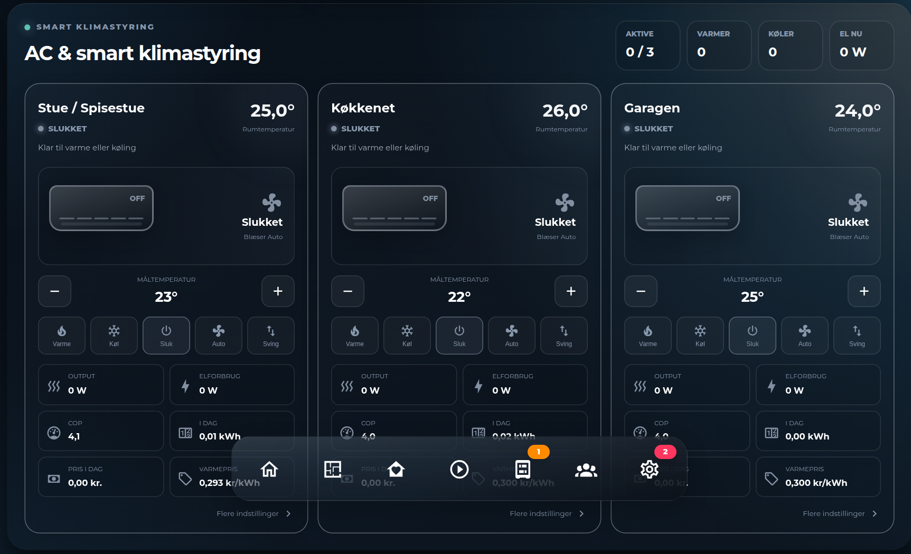

# HA AC Climate Card



> HACS installs both JavaScript files automatically. For a manual installation,
> copy `ha-ac-climate-card.js` and `ha-card-list-editor.js` into the same folder.

A Home Assistant Lovelace card for AC units and heat pumps: an animated
indoor-unit graphic per unit (airflow, mode, target temperature), live
power/COP/cost metrics, and full interactive control — mode buttons, target
temperature +/-, a compact fan-speed menu, and swing control — right from the
card. The unit grid automatically fills the available width, whether the card
contains one, two, or several AC units.

Works with any `climate` entity that exposes `current_temperature` /
`temperature` and the standard mode/fan/swing attributes. Power, COP and cost
readouts are optional and simply omitted when the matching sensor isn't
configured.

Plain JavaScript, no build step — copy the file in and register it as a
dashboard resource.

The visual card editor provides entity pickers and add/remove controls for AC
units. Layout columns automatically fill the available width for any unit count.

> **Note:** the card's on-screen labels (mode names, status text, button
> labels) are currently Danish only, since that's the household this card
> was built for. There's no built-in translation layer yet — fork the file
> and edit the label strings directly if you need another language.

## Installation

### HACS (custom repository)

1. In HACS, go to **Frontend** → the three-dot menu → **Custom repositories**.
2. Add `https://github.com/MRDonnii/ha-ac-climate-card` as type **Dashboard**.
3. Install **HA AC Climate Card** and add the resource if HACS doesn't do it
   automatically.

### Manual

1. Download `ha-ac-climate-card.js` from the latest release (or this repo).
2. Copy it to `config/www/community/ha-ac-climate-card/ha-ac-climate-card.js`.
3. Add it as a dashboard resource:
   ```yaml
   url: /local/community/ha-ac-climate-card/ha-ac-climate-card.js
   type: module
   ```

## Usage

Add the card via the dashboard editor (search for "AC Climate") or in YAML:

```yaml
type: custom:ha-ac-climate-card
title: AC & heat pumps
animation: true
units:
  - name: Living room
    climate: climate.living_room_ac
    output: sensor.living_room_ac_heat_output
    input: sensor.living_room_ac_power
    cop: sensor.living_room_ac_cop
    daily_energy: sensor.living_room_ac_daily_energy
    daily_cost: sensor.living_room_ac_daily_cost
    heat_price: sensor.living_room_ac_heat_price
    hour_cost: sensor.living_room_ac_hour_cost
  - name: Garage
    climate: climate.garage_ac
```

Only `name` and `climate` are required per unit. Mode buttons always show;
the fan and swing buttons only appear when the `climate` entity reports
`fan_modes` / `swing_modes`.

## Configuration reference

| Key | Description |
|---|---|
| `title` | Card header text |
| `animation` | Toggle CSS animations (default `true`) |
| `units` | List of unit objects, see below |

### Unit object

| Key | Description |
|---|---|
| `name` | Unit label (required) |
| `climate` | `climate` entity — required; drives mode, target/current temperature, fan and swing control |
| `output` | Sensor (W) — heat/cool output, shown as a metric tile |
| `input` | Sensor (W) — electrical power draw |
| `cop` | Sensor — coefficient of performance |
| `daily_energy` | Sensor (kWh) — energy used today |
| `daily_cost` | Sensor — cost accrued today |
| `heat_price` | Sensor — price per kWh of heat delivered |
| `hour_cost` | Sensor — cost for the current hour |

All metric fields are optional and independently omitted from the card when
not configured.

Clicking **Flere indstillinger** opens the unit's `climate` entity more-info
dialog.

## License

MIT — see [LICENSE](LICENSE).
